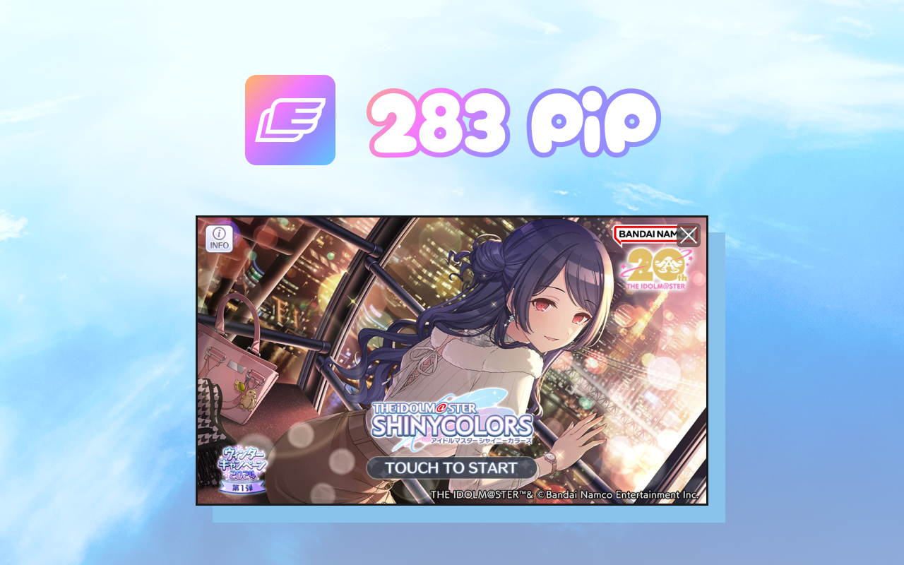
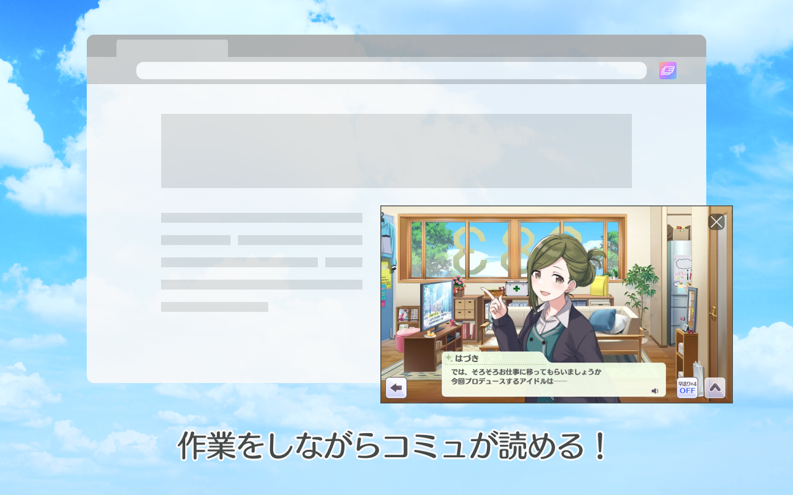
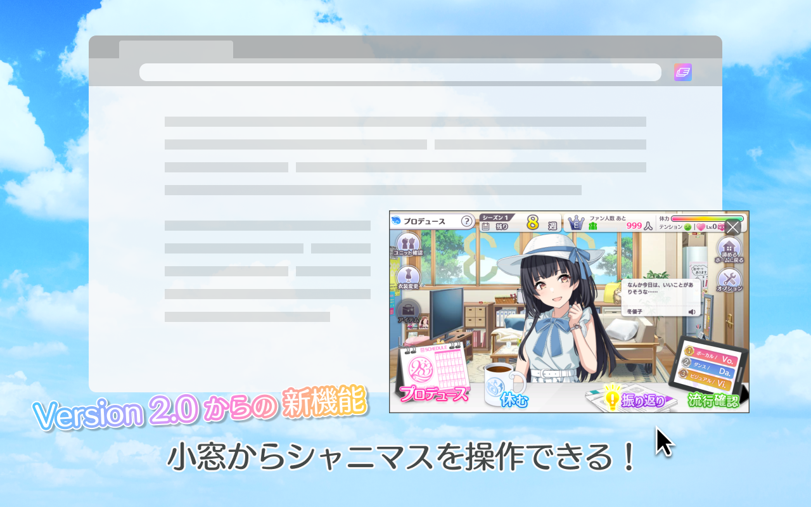

<h1 align="center">283 PiP</h1>

enza 版 アイドルマスター シャイニーカラーズ のゲームプレイ画面を小窓 (Picture-in-Picture) で表示するブラウザ拡張機能。

## 💿 インストール

[link-chrome]: https://chromewebstore.google.com/detail/gjpjhdmdbkiabejljimbnjdpmfdonpjb 'Chrome Web Store'

[][link-chrome]
[][link-chrome]

対応ブラウザ：
[][link-chrome]
[][link-chrome]
[][link-chrome]
[][link-chrome]

## :sparkles: できること

- シャニマスのゲーム画面を小窓で表示
- 小窓からゲーム画面を操作
- シャニマス内の各画面へのリンク

## 🖼️ スクリーンショット

|  |  |  |
| --- | --- | --- |

## ⛔️ 制限

- [Document Picture-in-Picture](https://developer.mozilla.org/en-US/docs/Web/API/Document_Picture-in-Picture_API) が必要なため Google Chrome 116 以上が必要
- Picture-in-Picture で表示したゲーム画面ではクリックのみ可能
- Picture-in-Picture には iframe で表示される領域は描画不可

## 🪪 クレジット表示

- [Wings icons created by Freepik - Flaticon](https://www.flaticon.com/free-icons/wings)

## 🛡️ ライセンス

MIT License